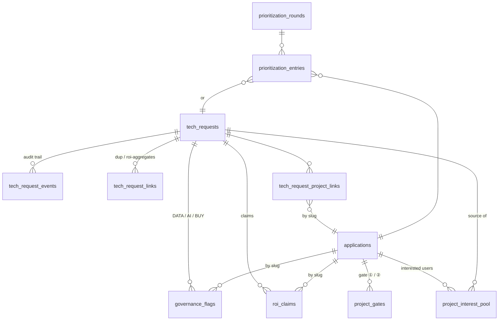

# ADR 0005 — Unified Technology Request: request registry & governance tracking

**Status:** Proposed — for discussion with the UTR working group (Hunter, Victoravich, Bartlett, Ewart, Robison)
**Date:** 2026-07-23
**Deciders:** Pending — Barrie Robison (IIDS) + UTR working group
**Related:** [ADR 0001](./0001-product-lifecycle-taxonomy.md) (lifecycle), [ADR 0004](./0004-clickup-ingestion-boundary.md) (ingestion pattern this extends), Migration 012 (enterprise-replacement facts), `UnifiedTechRequest/Unified Technology Request Process.pptx` (July 2026 draft), UTR meeting notes + email thread of 2026-07-20 → 2026-07-23

## Context

### The process being stood up

The Unified Technology Request combines IT, data, and AI governance behind
**one intake form** (an enhanced TDX form, per the 7/20 decision — not a
custom application) feeding **three tracks**, with governance **flags**
that attach to any track and **two gates** for in-house builds:

- **Fast lane** — automated screen at intake: low-risk data, individual
  license, self-funded, no integration; AI tools only if on the Approved
  AI Tools List (+ attestation). Auto-approval → purchase → auto-add to
  the application portfolio.
- **Joint Triage Team** (Data Gov Manager + CDAIO office + OIT TPM + IIDS
  proposed, weekly) — validates, estimates, pre-prioritizes, flags,
  routes. Checks whether an existing solution already meets the need
  (TPM may approve expanded use).
- **Track A — standard software** (buy/subscribe): scorecard → advisory
  board first review → assessment (purchasing, financial, vendor
  security) with flag reviews in parallel → approval at board / IT
  Steering / Leadership level → decision documented → prioritization
  (TBD) → purchase or convert to project.
- **Track B — fully built in-house app**: technical intake → CISO
  security review → flag reviews → **Gate ② OIT acceptance**
  (supportable? stack, docs, runbook, named owner, lifecycle funding) →
  prioritization (TBD) → hosting & handoff → operate.
- **Track C — idea/concept**: build registration (Claude Enterprise seat
  request = registered build intent) → feasibility & scoping with
  buy-vs-build check (→ Track A if a product fits) → **Gate ① early
  standards** (stack, hosting target, auth, data-access pattern,
  security requirements agreed before build) → design-stage flag
  reviews → prioritization (TBD) → development → joins Track B at
  security review.
- **Flags** — `DATA` (→ Data Stewards Committee, unchanged process),
  `AI` (→ AI Governance Working Group under the DGC; standard cases
  CDAIO decides, material exposure goes to the President's Core Team;
  reviews feed the Approved AI Tools List), `BUY` (a commercial product
  likely serves the need → route through Track A before development
  resources are spent). Unresolved flags block approval.
- **Prioritization** — deliberately TBD in all three tracks; one shared
  model expected. "Bottom line ROI" per Scott Green means **hard-dollar
  savings from replacing software and contracts**, not time savings; a
  multi-dimensional framework is being drafted (Ben + Scott).

### What the email thread adds (the requirements this ADR serves)

1. **Approved-tools transparency** (Ben/Lisa/Dan): publish the
   pre-approved list up front, **sortable/searchable by function**, so
   requestors can pick a functionally equivalent approved tool and hit
   the fast lane.
2. **Request ↔ project matching** (Barrie's stretch goal): when a
   request matches a build project underway or already requested,
   connect the requestor to a **growing pool of interested users and
   testers** — increasing buy-in and pilot capacity.
3. **ROI aggregation**: a new request can **add ROI to a pending
   request/project and change prioritization in the next round** (never
   existing commitments). The system should be "a more dynamic data
   asset for prioritization and ROI tracking."

### What this repo already has

| Asset | Where | Relation to UTR |
|---|---|---|
| Project registry (`applications` + `lib/portfolio.ts`) | Migrations 003/005/007/008/012 | The AI project inventory the site is canonical for |
| Enterprise-replacement facts (incumbent system, annual cost, renewal) | Migration 012 | *Is* Scott's bottom-line ROI, per project (OpenERA→VERAS $150k/yr already recorded) |
| Intake Crosswalk (`lib/governance-profile.ts`, `/coordination/intake-crosswalk`) | July 2026 | Already mirrors the UTR vocabulary: `IntakeTrack` (fast-lane/A/B/C/external), `BuildType`, provisional `DataClassification`, `AiRiskTier` — derived + override, read-only |
| ROI rubric placeholder (`lib/roi-rubric.ts`, `ROI_RUBRIC_READY=false`) | July 2026 | Waiting on the Ben/Scott framework |
| ClickUp request backlog (`clickup_requests`, 11-criterion rubric) | ADR 0004, `/portfolio/pipeline` | The current *de facto* request queue — but IIDS-only |
| Site submissions (`submissions` + similarity engine + `/intake/[token]`) | Migrations 001–003, Sprint 3a | A second request-shaped stream; evaluation requests (GEO/Scrunch) are seeded into it by hand (migrations 013, 017) |
| OIT pathway model (`lib/oit-pathway.ts`, six-stage Builder Guide) | PR #283 | The stage/gate machinery Track B/C formalizes |
| Friction ledger (`blockers`) | Migration 005 | Adjacent but distinct: what *stalls* work, vs. flags = governance review state |

### The gap

Requests are not first-class. Today a "request" is scattered across four
shapes — a ClickUp form response, a site submission, a hand-seeded
migration (GEO), and soon a TDX ticket — with no shared identity, no
track/stage/disposition, no flag or gate state, no link graph to
projects or to each other, and no ROI ledger that can aggregate across
that graph. TDX will own the *workflow*; nothing will own the
*institutional memory* — which is exactly the "dynamic data asset" the
thread asks for, and exactly what this site's Postgres is positioned to
be.

## Decision (proposed)

### 1. Extend the source-of-truth boundary, not the pattern

Same architecture as ADR 0004 — per-source **projection** tables filled
by pull-only sync, plus site-canonical **registry** tables that
projections upsert into and that site-owned facts (links, claims,
decisions) attach to. No write-back.

| Data | System of record |
|---|---|
| Request workflow: ticket state, routing, approvals, notifications | **TDX** (per the 7/20 decision) |
| IIDS build workflow: status narrative, daily work | **ClickUp** (unchanged, ADR 0004) |
| Request identity across sources, request↔project graph, interest pools, ROI claims, prioritization history, published governance state | **This site's Postgres** — the registry layer |
| Track/stage/flag/gate vocabularies, approved-tools list, governance bodies | **Typed TS modules** (rule 9; git log = audit trail) |

### 2. New entities

**`tech_requests`** — the canonical request registry, one row per
request regardless of origin.

- Identity: `id UUID`, `origin` (`tdx` | `clickup` | `site-submission` |
  `direct`), origin refs (`tdx_ticket_id`, `clickup_task_id` soft;
  `submission_id` FK — submissions are never truncated), unique per
  origin ref.
- Requestor: name, email, unit (named humans are load-bearing UI).
- Substance: `title`, `need_statement`, wizard-shape classification
  arrays (reuse the migration-003 columns' vocabulary so the similarity
  engine works unchanged).
- Routing: `track` (null until triaged), `stage` (per-track slug, TS
  vocabulary, no CHECK — 006/007/008 precedent), `approval_level`
  (`advisory-board` | `it-steering` | `leadership`).
- Outcome: `disposition` (`open` | `fast-tracked` | `approved` |
  `denied` | `withdrawn` | `merged` | `converted-to-project` |
  `routed-to-existing`), `decided_at`, `decided_by`,
  `decision_summary` — the deck's "decision documented" step, durable.

  `routed-to-existing` is the "existing solution meets need" outcome:
  it closes the request *and* (with a link + interest-pool row) delivers
  Barrie's connect-the-requestor behavior.

**`tech_request_events`** — append-only audit: `request_id`, `at`,
`actor`, `event_type` (`received`, `triaged`, `track-assigned`,
`stage-advanced`, `flag-raised`, `flag-resolved`, `routed`, `decision`,
`merged`, `converted`), `from_value`, `to_value`, `note`. The
standards-watch "git log as audit trail" ethos, in the DB where the
subject lives.

**`governance_flags`** — `flag_type` (`data` | `ai` | `buy`), subject =
`request_id` FK *or* `application_slug` (soft key — survives portfolio
re-seed, same rationale as ADR 0004 §1), `state` (`raised` |
`in-review` | `resolved-with-conditions` | `cleared` |
`not-applicable`), `reviewing_body` (`data-stewards` | `aigwg`),
`decision_authority` (`cdaio` | `presidents-core-team`), `findings`,
`conditions TEXT[]`, `raised_at`, `resolved_at`. "Unresolved flags
block approval" becomes a queryable predicate, and flag conditions
carry into the consolidated assessment package the deck requires.
Distinct from `blockers` (friction ≠ review state); a flag stalled
past SLA can *surface* as a blocker, not replace it.

**`project_gates`** — `application_slug` (soft), `gate`
(`standards-before-build` ① | `oit-acceptance` ②), `status`
(`not-reached` | `scheduled` | `passed` | `returned-with-changes`),
`decided_on`, `decided_with` (named OIT/RCDS humans), `agreements
JSONB` (① stack, hosting target, auth, data-access pattern, security
reqs; ② docs, runbook URL, named owner, lifecycle funding). Gate ①
maps onto Builder Guide stages 1–2, Gate ② onto stages 4–5
(`lib/oit-pathway.ts` gains the mapping so `/coordination/oit-pathway`
and the UTR view tell one story). Supersedes the coarse
`institutional_review_status` field over time (deprecation, not
removal).

**`tech_request_project_links`** — `request_id` ↔ `application_slug`
(soft), `link_type` (`duplicate-of` | `expanded-use` | `interest` |
`converted-to` | `supersedes` | `informs`), `created_by` (`triage` |
`similarity-engine` | `admin`), optional `score`, `note`. UNIQUE on
(request, slug, type). **`tech_request_links`** does the same
request↔request (`duplicate-of` | `roi-aggregates-to` | `related`).
This is the graph the email thread's stretch goal runs on; the
existing `similarity_matches` engine (array-overlap, GIN indexes)
extends to propose these links for triage confirmation.

**`project_interest_pool`** — `application_slug` (soft), person (name,
email, unit), `source_request_id`, `role` (`requestor` |
`interested-user` | `tester` | `pilot-candidate`), `status` (`active` |
`contacted` | `enrolled-in-pilot` | `declined`), `joined_at`. The
"growing pool of interested users." Deliberate tie-in: ADR 0001's
`piloting` status requires a `pilotCohort` — the pool is where cohorts
come from, so matching requests to builds directly feeds the lifecycle
verifier's evidence requirements.

**`roi_claims`** — subject = `application_slug` (soft) or `request_id`;
`dimension` (typed TS vocabulary, initially `hard-dollar-replacement` |
`capacity-fte` | `cost-avoidance` | `revenue` | `risk-reduction` |
`time-savings` — deliberately extensible so the Ben/Scott framework
lands as vocabulary + labels, not a schema change), `annual_value_usd`
and/or `fte`, `basis` (plain-language justification), `source`
(`clickup-sync` | `worksheet` | `triage` | `cadso-rubric` |
`owner-attested`), `status` (`estimated` | `attested` | `verified` |
`realized`), `effective_fy`, `claimed_by`, `claimed_at`.

Migration 012's columns stay as the incumbent-contract *facts*;
`roi_claims` records the *savings claims* derived from them (OpenERA
replacing VERAS → `hard-dollar-replacement`, $150k/yr, FY28, source
`owner-attested` per the ORED commitment; SAS/IR-dashboards
replacement → $80–100k/yr per Dan). ClickUp `roi_fte` syncs in as
`capacity-fte` claims. **Aggregation:** a project's ROI for
prioritization = its own claims + claims on requests linked via
`interest` / `expanded-use` / `roi-aggregates-to` / `converted-to` — a
SQL view, so a new request arriving mid-cycle visibly moves the
number for the *next* round.

**`prioritization_rounds` + `prioritization_entries`** — round (name,
cycle, forum, `status`: `planned` | `open` | `closed`) and entries
(subject request or project, `inputs JSONB` snapshot of rubric score +
aggregated ROI *at decision time*, `rank`, `decision`: `committed` |
`deferred` | `declined`, `rationale`). Snapshotting enforces the
thread's rule mechanically: committed entries are frozen with the
evidence they were decided on; new ROI only changes open/planned
rounds. The ClickUp 11-criterion rubric is one scoring input, not the
model — the model itself stays TBD (parking-lot #1) and pluggable.

**Approved tools** — start as a typed module `lib/approved-tools.ts`
(name, vendor, `functions[]` from a small new task-function vocabulary,
approval scope `individual-fast-lane` | `unit` | `enterprise`, steward
`oit` | `aigwg`, conditions incl. attestation + data-classification
ceiling, status, review-by date), because each list change is a
commit-worthy governance decision and OIT owns the canonical list
(parking-lot #5). Promote to a synced table only if OIT's source grows
an API. Powers the public sortable/searchable-by-function page and the
"functionally equivalent approved alternative" suggestion at intake.

### 3. TypeScript modules

- `lib/utr.ts` — Track, per-track Stage, Disposition, FlagType/State,
  Gate, ApprovalLevel vocabularies + labels + the escalation ladder and
  governance bodies (Joint Triage → AIGWG/Stewards → DGC → Core Team)
  as data. `lib/governance-profile.ts` imports `IntakeTrack` from here
  instead of defining it.
- `lib/requests.ts` — Postgres read module for request surfaces
  (mirrors `lib/work.ts`).
- `lib/roi-rubric.ts` — gains the dimension vocabulary + aggregation
  helpers; `ROI_RUBRIC_READY` flips only when the CADSO rubric lands.
- `lib/approved-tools.ts`, `lib/tool-functions.ts` — as above.
- `lib/similarity.ts` — extend to request↔application and
  request↔request profiles (same overlap engine), plus
  request↔approved-tool function matching for Track A.

### 4. Surfaces

| Surface | Change |
|---|---|
| `/portfolio/pipeline` | Becomes the unified request queue: all origins, track/stage/flag chips, disposition; rubric scores stay. **Shipped 2026-07-24** (pulled forward from Phase 2 — see amendment below) |
| `/coordination/intake-crosswalk` | Gains real flag/gate/ROI-claim data as it exists; "pending" cells retire one by one |
| `/standards/approved-tools` (new sub-page, `subNavItems` row in `app/standards/layout.tsx` per rule 11) | The sortable/searchable-by-function transparency list + fast-lane criteria |
| `/portfolio/[slug]` | Interest-pool count ("N units have asked for this"), bottom-line-ROI line with basis, gate status |
| `/internal/prioritization` | Round workbench: open round, ranked entries, aggregated-ROI evidence; internal until the process settles |
| Submit-a-Project | Files into `tech_requests` (origin `site-submission`); the existing live-similarity step gains a one-click "add me to the interested-users pool" on matches — the cheapest possible version of the stretch goal, shippable early |

### 5. Sync

`scripts/sync-tdx.ts` + `tdx_requests` projection table, modeled
exactly on ADR 0004 (pull-only, per-source, no FKs, `sync_runs`
freshness, stale-beats-missing), once Dan's team provides API access to
the enhanced-form ticket type. Until then the registry is fed by the
ClickUp sync (upsert `origin='clickup'` rows), site submissions, and a
CSV/manual import path for the in-flight-request migration
(parking-lot #8). The registry is what makes "one queue on day one"
possible before TDX integration lands.

## Phasing

- **Phase 1 — registry + bottom-line ROI** (no external dependencies;
  Migration 018): `tech_requests`, `tech_request_events`,
  `tech_request_links`, `tech_request_project_links`, `roi_claims`;
  `lib/utr.ts`; backfill ClickUp requests, site submissions, and the
  GEO/Scrunch records into the registry; seed hard-dollar claims
  (OpenERA/VERAS from migration 012 facts, SAS/IR replacement,
  Financial Planning Suite/Axiom); bottom-line-ROI column on the
  crosswalk. *Directly serves Barrie's action item from the 7/20
  meeting (flag current projects with bottom-line ROI before Ben's
  meeting with Scott).*
- **Phase 2 — the graph** (the email stretch goals): 
  `project_interest_pool`, similarity extension to requests, the
  Submit-a-Project interest hook, ROI aggregation view, project-detail
  and pipeline surfacing.
- **Phase 3 — governance state**: `governance_flags`, `project_gates`,
  `lib/approved-tools.ts` + `/standards/approved-tools`, oit-pathway
  gate mapping, `institutional_review_status` deprecation plan.
- **Phase 4 — prioritization + TDX**: `prioritization_rounds`/`entries`
  + `/internal/prioritization`; `tdx_requests` sync when API access
  exists; in-flight migration import.

Each phase is independently shippable and follows existing rules: SQL
migration + typed module + `seed`/`verify` updates + `npm run build`.

## Open questions (mapped to the deck's parking lot)

1. **Prioritization model** (PL-1/2): schema snapshots inputs and
   stays scoring-agnostic; the model plugs in later. Who owns round
   cadence?
2. **Approved-products-by-task ownership** (PL-5): OIT owns the list;
   our module is the transparency copy. Confirm the handoff/refresh
   ritual (and the AIGWG carve-out for frontier-AI subscriptions).
3. **APM 30.11 alignment**: `DataClassification` in
   `lib/governance-profile.ts` stays provisional until the office
   confirms tiers.
4. **ROI dimensions**: vocabulary lands when the Ben/Scott framework
   is written; `hard-dollar-replacement` is stable now per Scott's
   definition.
5. **App-inventory boundary**: TDX's application portfolio (all
   enterprise software, incl. fast-lane purchases) vs. this registry
   (AI projects with deep evidence). Proposed: fast-lane purchases do
   *not* become portfolio entries; Track A enterprise purchases that
   convert to projects do (`buildType: "bought"` already exists).
   Cross-reference by name/ID once TDX sync lands.
6. **AI seat registry** (PL-9): Track C's seat-request-as-registration
   is deferred; model later as a request event/subtype once the
   CDAIO's allocation practice exists.
7. **Research boundary** (PL-7): out of scope, matching the process
   scope; `origin`/`track` vocabularies extend without schema change if
   that changes.

## What we deliberately do not build

- **No workflow engine.** TDX routes, notifies, and holds approvals;
  we mirror state and own memory. No approval actions on this site.
- **No write-back** to TDX or ClickUp (unchanged from ADR 0004; the
  write side remains future work with its own ADR).
- **No parallel approved-tools authority** — the module renders OIT's
  and AIGWG's decisions, it doesn't make them.
- **No public prioritization surface** until the working group settles
  the model — internal first, same graduation path as ClickUp
  timelines.

## Amendments

### 2026-07-24 — One public queue; no public/internal split

**Context.** Phase 1 shipped the registry with an auth-gated queue at
`/internal/requests` while `/portfolio/pipeline` still read only the
ClickUp projection — two request surfaces telling different stories
(a site-submitted request was in the registry but invisible on the
public queue). The portfolio owner's call: the site is the project
inventory and the primary organization and communication tool (Chief
AI & Data Science Officer onboarding is the immediate audience), it
will ultimately merge with OIT's TDX, and **all pages tell the same
story with no public vs. internal distinction**.

**Decision.**

- `/portfolio/pipeline` is the canonical, public, all-origin queue
  (the Phase 2 line item, pulled forward): registry rows drive state;
  ClickUp enrichment supplies rubric scores where they exist; unscored
  arrivals render in an "awaiting scoring" section until triage.
- `/internal/requests` redirects to `/portfolio/pipeline`.
- Requestor names render publicly — consistent with the site's
  owner-named ethos.
- The Operational Excellence survey's eight candidate projects are
  registered as `origin: 'direct'` rows (Migration 019), dispositions
  `open`; coverage analysis rides in need statements and project links
  (`informs` / `interest`), and formal routing decisions remain
  triage's call.
- This supersedes the "internal first" posture above **for the request
  queue**. Prioritization rounds (Phase 4) will make their own
  visibility call when they land.
